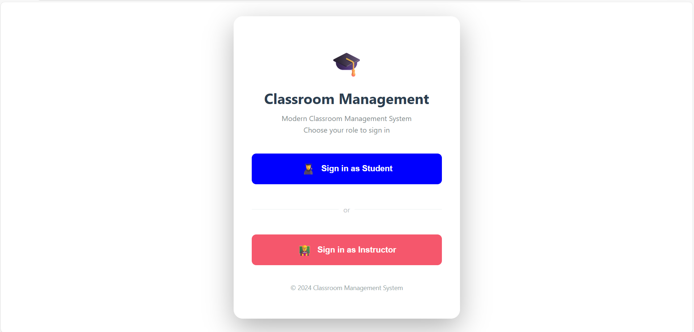
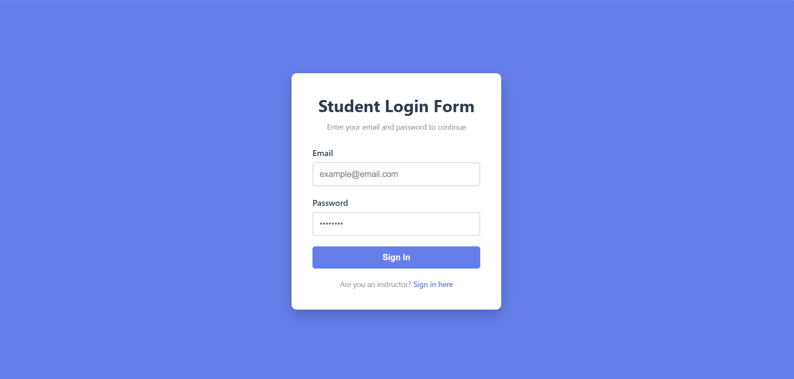

# Classroom Management Application

A real-time classroom management system that enables instructors to manage students, assign lessons, and communicate via live chat.

---

## 📋 Table of Contents

- [Features](#features)
- [Tech Stack](#tech-stack)
- [Prerequisites](#prerequisites)
- [Installation](#installation)
- [Configuration](#configuration)
- [Running the Application](#running-the-application)
- [Screenshots](#screenshots)

---

## Features

### Authentication

- **Instructor**: SMS-based login with 6-digit OTP via Twilio
- **Student**: Email-based login with 6-digit verification code
- Secure JWT token authentication

### Instructor Features

- Add, edit, and delete student profiles
- Assign lessons to one or multiple students
- View student progress and lesson completion status
- Real-time chat with students
- Send automated setup emails to new students

### Student Features

- View assigned lessons
- Mark lessons as completed
- Edit personal profile information
- Real-time chat with instructor

### Real-Time Communication

- Socket.io powered instant messaging
- Message history persistence
- Live updates across all connected devices

---

## Tech Stack

**Frontend**: React 18, Vite, TypeScript/JavaScript, Socket.io Client, Axios

**Backend**: Node.js, TypeScript, Express.js, Socket.io

**Database**: Firebase Realtime Database

**Services**: Twilio (SMS), Nodemailer (Email)

---

## Prerequisites

Before you begin, ensure you have installed:

- **Node.js** (v16 or higher) - [Download](https://nodejs.org/)
- **npm** (v8 or higher)
- **Git** - [Download](https://git-scm.com/)

You'll also need accounts for:

- [Firebase](https://firebase.google.com)
- [Twilio](https://www.twilio.com)
- Gmail account (for sending emails)

---

## Installation

### Step 1: Clone the Repository

```bash
git clone https://github.com/Phanvangiu/Class_management_application.git
cd Class_management_application
```

### Step 2: Install Dependencies

#### Backend

```bash
cd backend
npm install
```

#### Frontend

```bash
cd ../frontend
npm install
```

---

## Configuration

### 1. Firebase Setup

1. Go to [Firebase Console](https://console.firebase.google.com)
2. Create a new project
3. Enable **Realtime Database**:
   - Go to Build → Realtime Database
   - Click "Create Database"
   - Start in test mode
4. Get Service Account Key:
   - Go to Project Settings → Service Accounts
   - Click "Generate New Private Key"
   - Save as `serviceAccountKey.json` in `backend/` folder
5. Copy your Database URL (e.g., `https://your-project.firebaseio.com/`)

### 2. Twilio Setup

1. Sign up at [Twilio](https://www.twilio.com)
2. Get your credentials from Console Dashboard:
   - Account SID
   - Auth Token
   - Phone Number (get a free trial number)

### 3. Gmail App Password

1. Enable 2-Step Verification in Google Account
2. Go to Security → App Passwords
3. Generate password for "Mail"
4. Copy the 16-character password

### 4. Backend Environment Variables

Create `.env` file in `backend/` folder:

```env
PORT=5000
NODE_ENV=development

# Twilio
TWILIO_ACCOUNT_SID=your_twilio_account_sid
TWILIO_AUTH_TOKEN=your_twilio_auth_token
TWILIO_PHONE_NUMBER=+1234567890

# Email
EMAIL_USER=your.email@gmail.com
EMAIL_PASSWORD=your_16_char_app_password

# JWT
JWT_SECRET=your_random_secret_key_min_32_characters

# Frontend
FRONTEND_URL=http://localhost:5173

# Firebase
FIREBASE_DATABASE_URL=https://your-project-id.firebaseio.com/
```

**Important**: Replace all placeholder values with your actual credentials.

### 5. Frontend Environment Variables

Create `.env` file in `frontend/` folder:

```env
VITE_API_URL=http://localhost:5000
VITE_SOCKET_URL=http://localhost:5000
```

---

## Running the Application

### Option 1: Run Separately (Recommended)

**Terminal 1 - Backend:**

```bash
cd backend
npm run dev
```

Backend runs on: `http://localhost:3001`

**Terminal 2 - Frontend:**

```bash
cd frontend
npm run dev
```

Frontend runs on: `http://localhost:5173`

### Access the Application

Open your browser and go to:

```
http://localhost:5173
```

---

## Screenshots

### Login Pages





_Instructor login with phone number_


_Student login with email_

### Instructor Dashboard


_Main dashboard with student overview_


_Manage students - add, edit, delete_


_Assign lessons to students_

### Student Dashboard


_Student view of assigned lessons_


_Complete lessons and track progress_

### Chat Interface


_Live messaging between instructor and students_

### Profile Management


_Update personal information_

---

## Troubleshooting

### Backend won't start

- Check if `.env` file exists in `backend/` folder
- Verify all environment variables are set correctly
- Ensure `serviceAccountKey.json` is in `backend/` folder
- Check if port 5000 is available

### Frontend won't start

- Check if `.env` file exists in `frontend/` folder
- Verify `VITE_API_URL` and `VITE_SOCKET_URL` are correct
- Check if port 5173 is available

### SMS not sending

- Verify Twilio credentials in `.env`
- Check phone number format: must include country code (e.g., +1234567890)
- For trial accounts, verify recipient numbers in Twilio console

### Email not sending

- Use Gmail App Password, not regular password
- Ensure 2-Step Verification is enabled
- Remove spaces from the 16-character app password

### Firebase connection error

- Verify `FIREBASE_DATABASE_URL` is correct
- Check if `serviceAccountKey.json` is valid
- Ensure Realtime Database is created and enabled

### Socket.io not connecting

- Verify backend is running on port 5000
- Check `VITE_SOCKET_URL` in frontend `.env`
- Ensure CORS is properly configured
